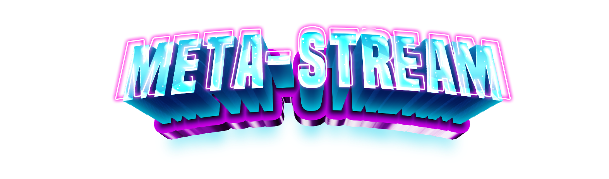

# MetaStream: The World's Most Advanced Open Source Broadcasting System Powered by AI

  

## Overview

MetaStream is a cutting-edge, AI-powered broadcasting platform designed to revolutionize content creation, streaming, and multi-platform broadcasting. Our comprehensive solution combines advanced technology, artificial intelligence, and user-friendly design to empower creators of all levels.

## Key Features

### 🤖 AI-Powered Production Tools
- **AI Director**: Automatic scene switching based on voice, movement, and content activity
- **Smart Green Screen**: Real-time background removal without physical chroma key setup
- **Voice Commands**: Hands-free stream control using natural language
- **AI Assistant**: Real-time suggestions and stream management assistance

### 🖥️ Cross-Platform Support
- Multi-platform simultaneous streaming
- Supported Platforms:
  - Twitch
  - YouTube
  - Facebook Gaming
  - TikTok
  - Instagram
  - SuperLive
  - BIGO Live
  - Custom RTMP destinations

### 🎥 Advanced Streaming Capabilities
- High-quality multi-platform streaming
- Customizable stream settings
- Real-time stream statistics and performance monitoring
- Adaptive bitrate streaming
- Stream scheduling

### 🎨 Branding & Customization
- AI-powered logo generation
- Custom theme creation
- Dynamic overlay and layout design
- Personalized stream branding

### 🌐 VR & Advanced Integration
- Direct streaming from VR platforms
  - Meta Quest
  - SteamVR
  - Other VR platforms
- Advanced VR stream settings
- VR scene management

### 📊 Analytics & Community
- Comprehensive streaming analytics
- Viewer engagement tracking
- Community interaction tools
- Creator network integration

### 🔒 Privacy & Security
- Enhanced privacy controls
- Secure platform connections
- Two-factor authentication
- Data protection mechanisms

### 🌈 Accessibility
- Customizable interface
- Color blind modes
- Screen reader support
- Epilepsy-safe mode

## System Requirements

### Windows
- Windows 10 or later (64-bit)
- Minimum 4GB RAM
- DirectX 11 compatible graphics card
- Minimum Intel Core i5 or equivalent
- 50GB free disk space

### macOS
- macOS 10.15 or later
- Minimum 4GB RAM
- Metal-capable graphics card
- Minimum Intel Core i5 or Apple Silicon
- 50GB free disk space

## Installation

### Windows
1. Download the latest `.exe` from the releases page
2. Run the installer
3. Follow on-screen instructions

### macOS
1. Download the `.dmg` file
2. Drag MetaStream to your Applications folder
3. Launch the application

## Pricing

MetaStream offers flexible pricing to suit different creator needs:
- Free Tier: Basic features, limited streaming
- Creator Tier: Advanced tools, multi-platform streaming
- Pro Tier: Full AI capabilities, priority support

## Contributing

We welcome contributions! Please see our [CONTRIBUTING.md](CONTRIBUTING.md) for details on our code of conduct and the process for submitting pull requests.

## License

This project is licensed under the MIT License - see the [LICENSE.md](LICENSE.md) file for details.

## Support

- [Documentation](https://metastream.com/docs)
- [Discord Community](https://discord.gg/metastream)
- Email Support: support@metastream.com

## Technologies

- React
- TypeScript
- Tailwind CSS
- Supabase
- AI Integration
- WebRTC
- Electron

## Follow Us

- [Twitter/X](https://twitter.com/metastream)
- [YouTube](https://youtube.com/metastream)
- [Twitch](https://twitch.tv/metastream)

---

**Empower Your Streaming Journey with MetaStream - Where AI Meets Creativity**
